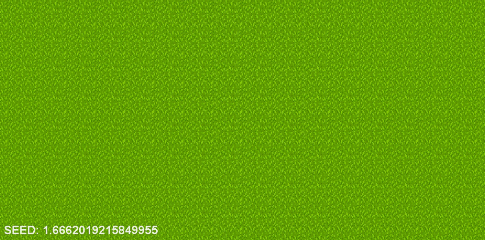
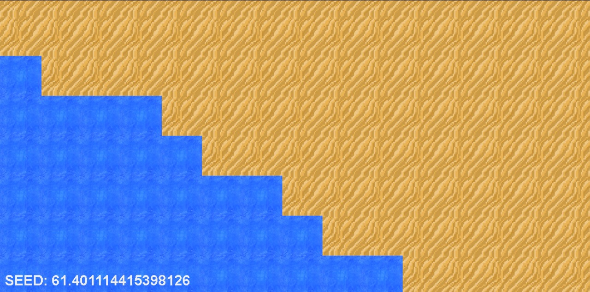

# Simple world generation

Randomly Generated World

## See it working on:
https://the-island-testing.netlify.app/

## Requisites

- pnpm, yarn or npm
- clone or download the repo
- install dependencies
- run

## To move around, use:
 - <code>W</code> to go up
 - <code>A</code> to go left
 - <code>D</code> to go right
 - <code>S</code> to go down

